# AutoComplyAI Enterprise - Architecture Diagrams

This document provides visual representations of the system architecture, including component diagrams and network flow diagrams.

---

## 📋 Table of Contents

1. [High-Level System Architecture](#high-level-system-architecture)
2. [Component Diagram](#component-diagram)
3. [Network Flow Diagram](#network-flow-diagram)
4. [Data Flow Diagram](#data-flow-diagram)
5. [Multi-Agent Orchestration Flow](#multi-agent-orchestration-flow)
6. [Detection Engine Pipeline](#detection-engine-pipeline)
7. [Deployment Architecture](#deployment-architecture)
8. [Database Schema](#database-schema)

---

## 🏗️ High-Level System Architecture

```mermaid
graph TB
    subgraph "Client Layer"
        Browser[Web Browser]
        API_Client[API Clients<br/>Python/JavaScript/cURL]
    end

    subgraph "Frontend Layer - Port 5173"
        React[React 18 + Vite]
        Router[React Router]
        Components[UI Components<br/>Dashboard, Scan, Reports, Architecture]
    end

    subgraph "Backend Layer - Port 8000"
        FastAPI[FastAPI Server]
        CORS[CORS Middleware]
        Routers[API Routers<br/>metrics, threat_feed, etc.]
    end

    subgraph "Business Logic Layer"
        Orchestrator[Agent Orchestrator]
        DetectionAgent[Detection Agent]
        ThreatIntelAgent[Threat Intel Agent]
        MitreAgent[MITRE Agent]
        ComplianceAgent[Compliance Agent]
        ReportAgent[Report Agent]
    end

    subgraph "Detection Engines"
        RuleEngine[Rule Engine<br/>Pattern Matching]
        MLEngine[ML Engine<br/>TF-IDF + Classifier]
        LLMEngine[LLM Engine<br/>GPT-4 / Mock]
        HybridEngine[Hybrid Engine<br/>Ensemble Voting]
    end

    subgraph "Data Layer"
        SQLite[(SQLite Database<br/>scans.db)]
        ThreatDB[(Threat Intelligence<br/>IOC Database)]
    end

    subgraph "External Services"
        OpenAI[OpenAI API<br/>GPT-4]
        ThreatFeeds[Threat Feeds<br/>External IOCs]
    end

    Browser --> React
    API_Client --> FastAPI
    React --> Router
    Router --> Components
    Components --> FastAPI
    FastAPI --> CORS
    CORS --> Routers
    Routers --> Orchestrator
    Orchestrator --> DetectionAgent
    Orchestrator --> ThreatIntelAgent
    Orchestrator --> MitreAgent
    Orchestrator --> ComplianceAgent
    Orchestrator --> ReportAgent
    DetectionAgent --> RuleEngine
    DetectionAgent --> MLEngine
    DetectionAgent --> LLMEngine
    DetectionAgent --> HybridEngine
    HybridEngine --> RuleEngine
    HybridEngine --> MLEngine
    HybridEngine --> LLMEngine
    LLMEngine --> OpenAI
    ThreatIntelAgent --> ThreatDB
    ThreatIntelAgent --> ThreatFeeds
    Routers --> SQLite
    ReportAgent --> SQLite

    style Browser fill:#e1f5ff
    style React fill:#61dafb
    style FastAPI fill:#009688
    style Orchestrator fill:#ff9800
    style SQLite fill:#003b57
    style OpenAI fill:#10a37f
```

---

## 🧩 Component Diagram

### Frontend Components

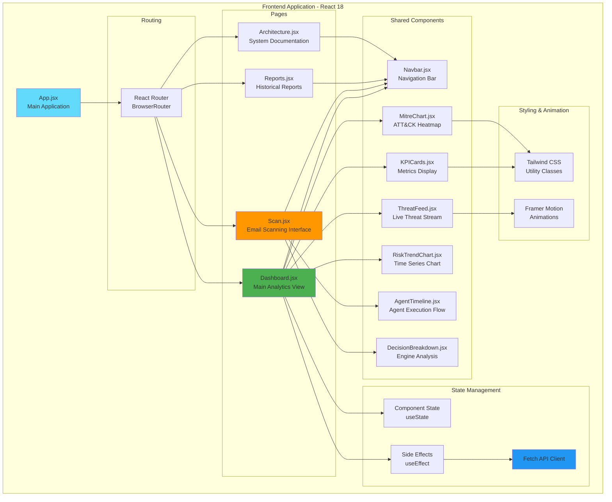

### Backend Components

```mermaid
graph TB
    subgraph "Backend Application - FastAPI"
        Main[main.py<br/>FastAPI App Entry]
        
        subgraph "API Layer"
            HealthEndpoint[/health<br/>Health Check]
            ScanEndpoint[/scan<br/>POST Email Scan]
            ScansEndpoint[/scans<br/>GET All Scans]
            MetricsRouter[/metrics<br/>KPI Metrics]
            ThreatFeedRouter[/threat-feed<br/>Recent Threats]
            MitreRouter[/mitre-heatmap<br/>ATT&CK Data]
            RiskTrendRouter[/risk-trend<br/>Time Series]
            ThreatStatsRouter[/threat-stats<br/>Statistics]
            ExportPDF[/export/pdf/{id}<br/>PDF Report]
            ExportJSON[/export/json/{id}<br/>Enhanced PDF]
        end
        
        subgraph "Service Layer"
            ScanService[scan_service.py<br/>Scan Orchestration]
            ThreatIntelService[threat_intel.py<br/>IOC Enrichment]
        end
        
        subgraph "Agent Layer"
            AgentOrchestrator[agent_orchestrator.py<br/>Multi-Agent Coordinator]
            DetectionAgent[detection_agent.py<br/>Threat Detection]
            ThreatIntelAgent[threat_intel_agent.py<br/>IOC Analysis]
            MitreAgent[mitre_agent.py<br/>ATT&CK Mapping]
            ComplianceAgent[compliance_agent.py<br/>Framework Mapping]
            ReportAgent[report_agent.py<br/>Report Generation]
            OpenAIAgent[openai_agent.py<br/>GPT-4 Integration]
        end
        
        subgraph "Detection Layer"
            DetectionOrchestrator[orchestrator.py<br/>Engine Coordinator]
            RuleEngine[rule_engine.py<br/>Pattern Matching]
            MLEngine[ml_engine.py<br/>ML Classifier]
            HybridEngine[hybrid_engine.py<br/>Ensemble Voting]
            LLMModel[llm_model.py<br/>LLM Interface]
        end
        
        subgraph "Data Layer"
            Database[database.py<br/>SQLAlchemy Session]
            Models[models.py<br/>ORM Models]
            Schemas[schemas.py<br/>Pydantic Schemas]
        end
        
        subgraph "Reporting Layer"
            ReportBuilder[report_builder.py<br/>PDF Generation]
        end
    end

    Main --> HealthEndpoint
    Main --> ScanEndpoint
    Main --> ScansEndpoint
    Main --> MetricsRouter
    Main --> ThreatFeedRouter
    Main --> MitreRouter
    Main --> RiskTrendRouter
    Main --> ThreatStatsRouter
    Main --> ExportPDF
    Main --> ExportJSON
    
    ScanEndpoint --> ScanService
    ScanService --> AgentOrchestrator
    
    AgentOrchestrator --> DetectionAgent
    AgentOrchestrator --> ThreatIntelAgent
    AgentOrchestrator --> MitreAgent
    AgentOrchestrator --> ComplianceAgent
    AgentOrchestrator --> ReportAgent
    
    DetectionAgent --> DetectionOrchestrator
    DetectionOrchestrator --> RuleEngine
    DetectionOrchestrator --> MLEngine
    DetectionOrchestrator --> HybridEngine
    
    HybridEngine --> RuleEngine
    HybridEngine --> MLEngine
    HybridEngine --> LLMModel
    
    OpenAIAgent --> LLMModel
    ThreatIntelAgent --> ThreatIntelService
    
    MetricsRouter --> Database
    ThreatFeedRouter --> Database
    MitreRouter --> Database
    RiskTrendRouter --> Database
    
    ExportPDF --> ReportBuilder
    ExportJSON --> ReportBuilder
    ReportBuilder --> Database
    
    Database --> Models
    ScanService --> Schemas

    style Main fill:#009688
    style AgentOrchestrator fill:#ff9800
    style DetectionOrchestrator fill:#f44336
    style Database fill:#3f51b5
```

---

## 🌐 Network Flow Diagram

### Request/Response Flow

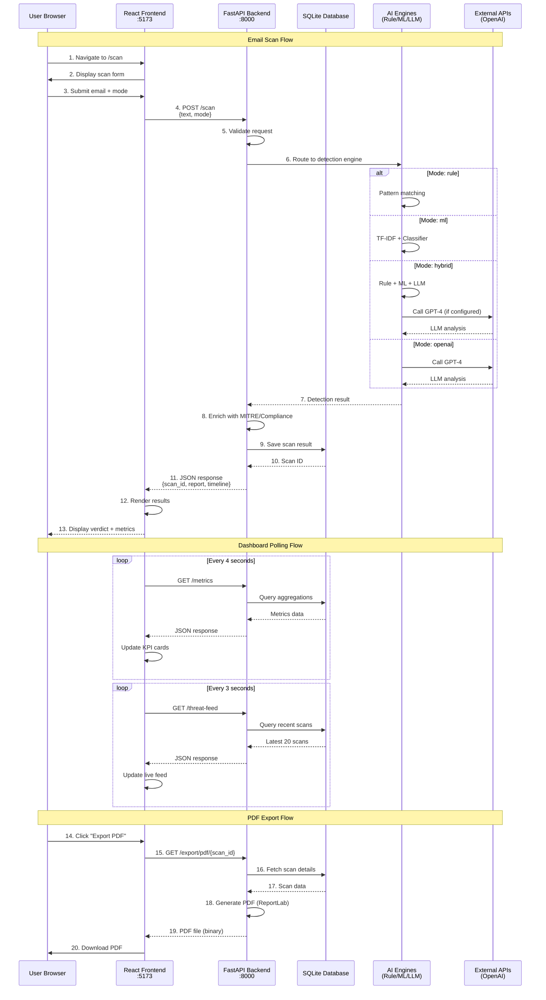

### Network Communication Ports

```mermaid
graph LR
    subgraph "Client Network"
        Browser[Web Browser<br/>User Machine]
    end
    
    subgraph "Application Network - Docker/Podman"
        Frontend[Frontend Container<br/>Port 5173<br/>Vite Dev Server]
        Backend[Backend Container<br/>Port 8000<br/>FastAPI + Uvicorn]
        Database[SQLite Volume<br/>scans.db]
    end
    
    subgraph "External Network"
        OpenAI[OpenAI API<br/>api.openai.com:443<br/>HTTPS]
        ThreatFeeds[Threat Intel Feeds<br/>Various Providers]
    end

    Browser -->|HTTP :5173| Frontend
    Browser -->|HTTP :8000| Backend
    Frontend -->|HTTP :8000| Backend
    Backend -->|File I/O| Database
    Backend -->|HTTPS :443| OpenAI
    Backend -->|HTTPS :443| ThreatFeeds

    style Browser fill:#e1f5ff
    style Frontend fill:#61dafb
    style Backend fill:#009688
    style Database fill:#003b57
    style OpenAI fill:#10a37f
```

---

## 📊 Data Flow Diagram

### Email Scan Data Flow

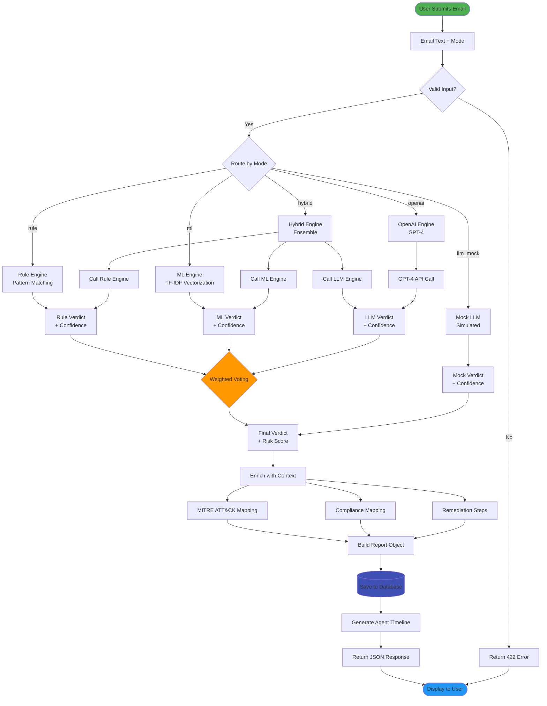

### Dashboard Data Aggregation Flow

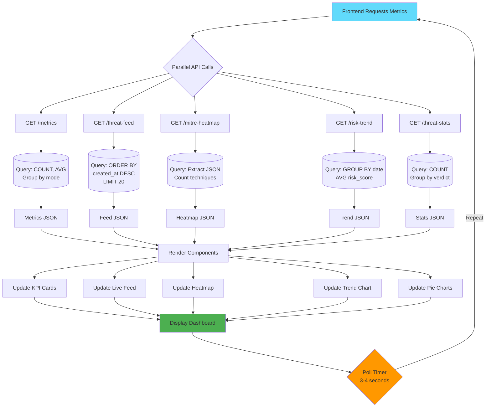

---

## 🤖 Multi-Agent Orchestration Flow

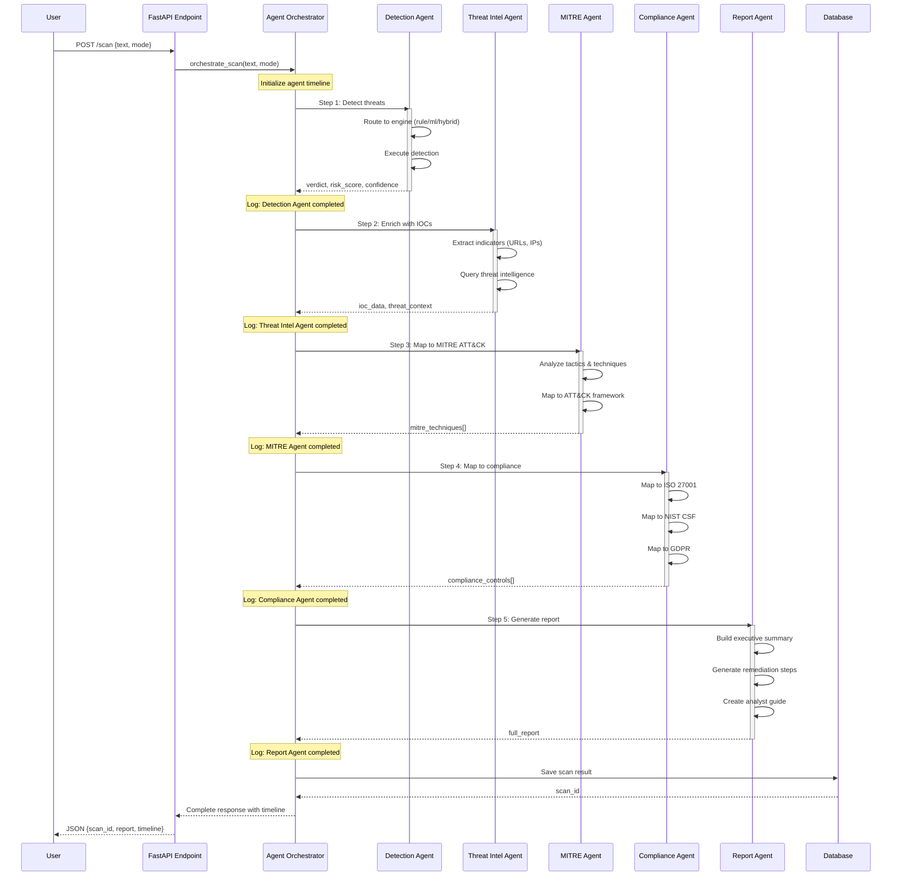

---

## ⚙️ Detection Engine Pipeline

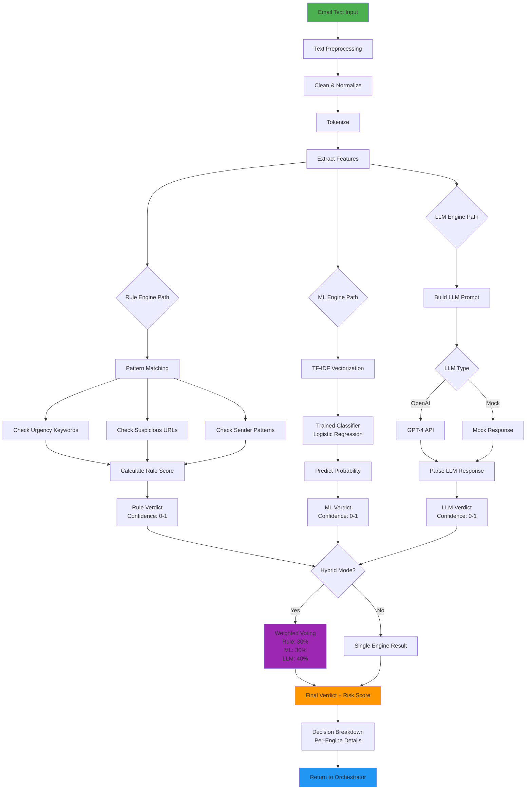

---

## 🐳 Deployment Architecture

### Container Architecture (Podman/Docker)

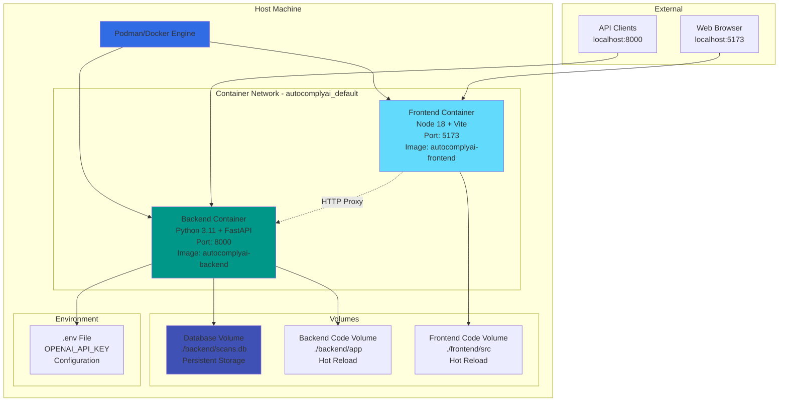

### Deployment Configuration (podman-compose.yml)

```yaml
services:
  backend:
    build: ./backend
    ports:
      - "8000:8000"
    volumes:
      - ./backend/app:/app/app
      - ./backend/scans.db:/app/scans.db
    environment:
      - OPENAI_API_KEY=${OPENAI_API_KEY}
    networks:
      - autocomplyai_default

  frontend:
    build: ./frontend
    ports:
      - "5173:5173"
    volumes:
      - ./frontend/src:/app/src
    depends_on:
      - backend
    networks:
      - autocomplyai_default

networks:
  autocomplyai_default:
    driver: bridge
```

---

## 🗄️ Database Schema

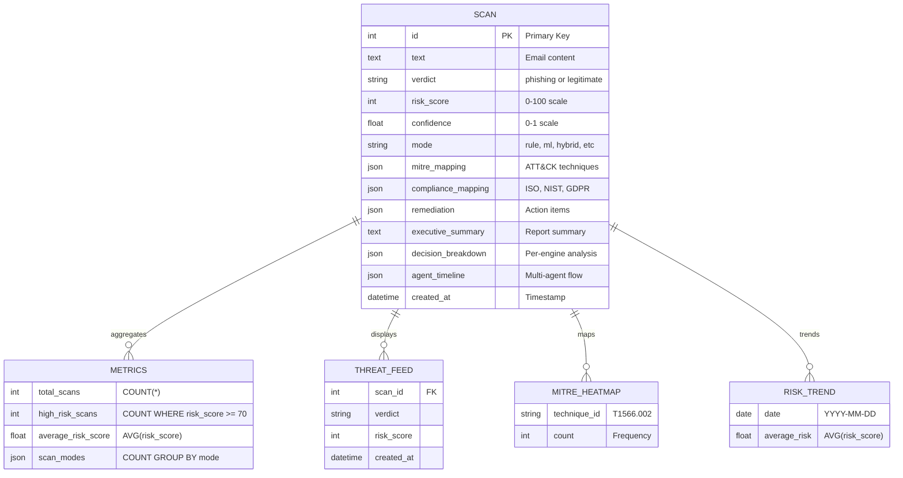

### Database Queries

**Metrics Query:**
```sql
SELECT 
    COUNT(*) as total_scans,
    COUNT(CASE WHEN risk_score >= 70 THEN 1 END) as high_risk_scans,
    AVG(risk_score) as average_risk_score,
    COUNT(CASE WHEN mode = 'rule' THEN 1 END) as rule_scans,
    COUNT(CASE WHEN mode = 'ml' THEN 1 END) as ml_scans,
    COUNT(CASE WHEN mode = 'hybrid' THEN 1 END) as hybrid_scans
FROM scan;
```

**Threat Feed Query:**
```sql
SELECT id, verdict, risk_score, mode, created_at
FROM scan
ORDER BY created_at DESC
LIMIT 20;
```

**Risk Trend Query:**
```sql
SELECT 
    DATE(created_at) as date,
    AVG(risk_score) as average_risk
FROM scan
GROUP BY DATE(created_at)
ORDER BY date DESC;
```

---

## 🔄 System Integration Points

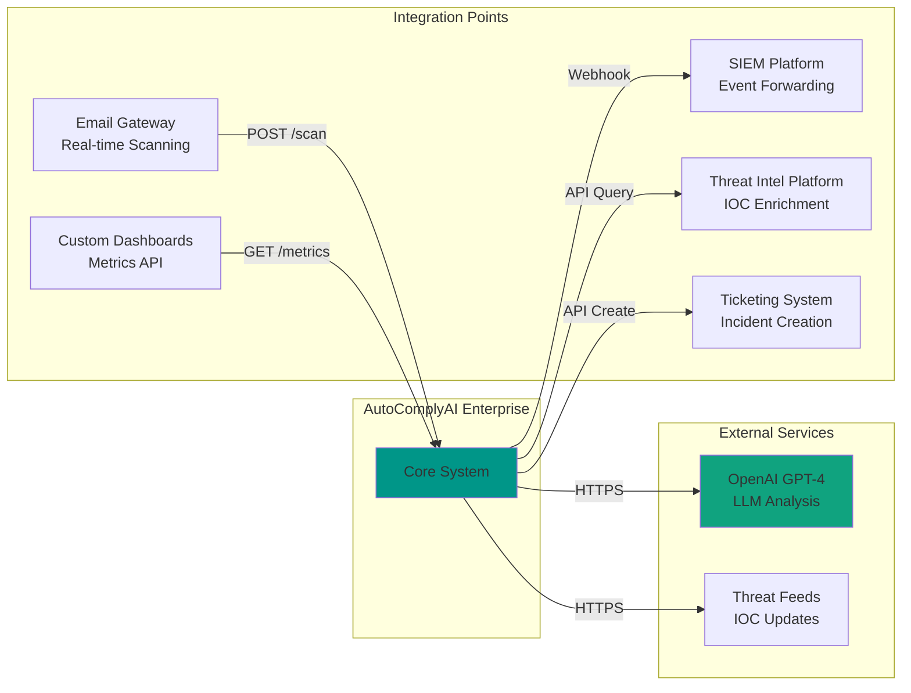

---

## 📈 Performance Characteristics

| Component | Response Time | Throughput | Scalability |
|-----------|--------------|------------|-------------|
| Rule Engine | <100ms | 1000+ req/s | Horizontal |
| ML Engine | ~500ms | 100+ req/s | Horizontal |
| Hybrid Engine | ~2s | 50+ req/s | Vertical |
| OpenAI Engine | 1-2s | 10+ req/s | API Limited |
| Database Queries | <50ms | 500+ req/s | Indexed |
| PDF Generation | ~200ms | 50+ req/s | CPU Bound |

---

## 🔐 Security Architecture

```mermaid
graph TB
    subgraph "Security Layers"
        Input[User Input] --> Validation[Input Validation<br/>Pydantic Schemas]
        Validation --> Sanitization[Text Sanitization<br/>XSS Prevention]
        Sanitization --> CORS[CORS Middleware<br/>Origin Control]
        CORS --> RateLimit[Rate Limiting<br/>DDoS Protection]
        RateLimit --> Auth[Authentication<br/>API Keys]
        Auth --> Authorization[Authorization<br/>Role-Based Access]
        Authorization --> Encryption[Data Encryption<br/>At Rest & Transit]
        Encryption --> Audit[Audit Logging<br/>Activity Tracking]
        Audit --> Response[Secure Response]
    end

    style Input fill:#f44336
    style Response fill:#4caf50
    style Auth fill:#ff9800
```

---

## 📝 Summary

This document provides comprehensive visual representations of:

✅ **High-level system architecture** with all layers  
✅ **Component diagrams** for frontend and backend  
✅ **Network flow diagrams** showing request/response patterns  
✅ **Data flow diagrams** for email scanning and dashboard aggregation  
✅ **Multi-agent orchestration** sequence diagrams  
✅ **Detection engine pipeline** with all modes  
✅ **Deployment architecture** using Podman/Docker  
✅ **Database schema** with relationships  
✅ **Integration points** for external systems  
✅ **Security architecture** layers  

**Viewing Diagrams:**
- All diagrams use Mermaid syntax
- View in GitHub, GitLab, or any Mermaid-compatible viewer
- Use VS Code with Mermaid extension for local viewing
- Export to PNG/SVG using Mermaid CLI or online tools

**Related Documentation:**
- [API Walkthrough Guide](./API_WALKTHROUGH_GUIDE.md)
- [Code Walkthrough Demo](./CODE_WALKTHROUGH_DEMO.md)
- [Architecture Page](http://localhost:5173/architecture)

---

**Updated By: Deepika Kothamasu**  
**Version 1.0.0**  
**Last Updated: 2026**